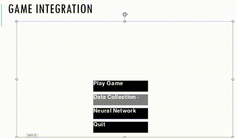

# Rocket Launcher Game Neural Network
### Author: Virendrasinh Chavda

<p align="justify">
This repository contains the code and resources for training and evaluating custom neural networks to predict gameplay outcomes and improve decision-making in the <strong>Rocket Launcher Game</strong>. The project demonstrates how neural networks can be built from scratch using Python and NumPy, alongside implementing advanced features like mini-batch gradient descent and activation functions like ReLU.
</p>


---

## Table of Contents
1. [Overview](#overview)
2. [Installation](#installation)
3. [Features](#features)
4. [Usage](#usage)
5. [Methodology](#methodology)
6. [Neural Network Implementation](#neural-network-implementation)
7. [Future Work](#future-work)
8. [Contributing](#contributing)
9. [License](#license)

---

## Overview

The Rocket Launcher Game Neural Network project involves:
1. <strong>Game Prediction</strong>:
   - Analyzing gameplay data to predict rocket hits, misses, and trajectory accuracy.
   - Using machine learning models to enhance decision-making during gameplay.
   
2. <strong>Custom Neural Networks</strong>:
   - Building neural networks from scratch without using high-level libraries like TensorFlow or PyTorch.
   - Implementing mini-batch gradient descent, ReLU activation, and other advanced features to optimize training.

3. <strong>Visualization and Simulation</strong>:
   - Simulating rocket launch trajectories and analyzing the results with real gameplay data.

---

## Installation

To set up and use this project, follow these steps:

1. Clone the repository:
   ```bash
   git clone https://github.com/VirendraChavda/Spaceship-Lander.git
   cd rocket-launcher-nn
   ```
2. Create a virtual environment:
   ```bash
   python -m venv env
   source env/bin/activate  # On Windows: env\Scripts\activate
   ```
3. Open the Jupyter Notebooks for training and analysis:
   ```bash
   jupyter notebook
   ```

## Features

### Neural Network Training
- Built a custom neural network to predict rocket hits and misses using gameplay data (`game.csv`).
- Trained with advanced techniques like:
  - Mini-batch gradient descent.
  - ReLU activation functions.
  - Forward and backward propagation implemented from scratch.

### Simulation and Visualization
- Simulated rocket trajectories using game logic and data.
- Visualized predictions using matplotlib to compare actual and predicted results.

### Gameplay Data Analysis
- Analyzed gameplay data (`game.csv`) for feature extraction and preprocessing.
- Engineered features to capture game dynamics for better predictions.

---

## Usage

### Data Preprocessing
- Use `RocketLauncher-Final.ipynb` to preprocess the gameplay data and extract features.
- Explore patterns in rocket launches and trajectories.

### Model Training
- Train the neural network from scratch using `GameNN.ipynb`.
- Implement mini-batch gradient descent for efficient training.

### Visualization
- Use `RocketLauncher-Mini-batch and Relu.ipynb` to visualize trajectory predictions.
- Compare predicted vs actual gameplay outcomes with custom visualizations.

### Run Simulations
- Simulate rocket launches with the data from `game.csv`.
- Play the `game.mp4` video for a demonstration of the Rocket Launcher Game.

---

## Methodology

### Datasets
- <strong>`game.csv`</strong>: Contains gameplay data, including rocket launch angles, velocities, and hit/miss outcomes.

### Steps

#### Data Analysis
- Cleaned and preprocessed gameplay data.
- Extracted key features such as launch angle, velocity, and success rates.

#### Neural Network Training
- Implemented forward propagation, loss computation, and backpropagation.
- Optimized the model with mini-batch gradient descent.

#### Evaluation
- Evaluated model performance with metrics like accuracy and loss reduction over epochs.
- Analyzed misclassified rocket launches.

---

## Neural Network Implementation

This project includes a custom implementation of a neural network built from scratch using Python and NumPy:

### Forward Propagation
- Compute activations for each layer using matrix multiplications.
- Activation functions include ReLU and Sigmoid.

### Backward Propagation
- Compute gradients using the chain rule to update weights and biases.
- Implemented loss gradients for binary cross-entropy.

### Optimization
- Mini-batch gradient descent for efficient training.
- Reduced overfitting by optimizing learning rates.

### Evaluation
- Visualized accuracy and loss curves over epochs.
- Compared predictions with ground truth from gameplay data.

---

## Future Work

### Model Improvements
- Experiment with additional activation functions like Tanh or Leaky ReLU.
- Implement deeper networks for improved accuracy.

### Additional Features
- Integrate gameplay logic for real-time decision-making.
- Incorporate reinforcement learning for adaptive gameplay strategies.

### Deployment
- Deploy the neural network as a web app to predict gameplay outcomes in real-time.
- Integrate with the Rocket Launcher Game to provide AI-driven assistance.

---

## Contributing

Contributions are welcome! Feel free to fork the repository, make improvements, and submit a pull request. If you encounter any issues, open a GitHub issue for discussion.

---

## License

This project is licensed under the MIT License. See the [LICENSE](./LICENSE) file for more details.
